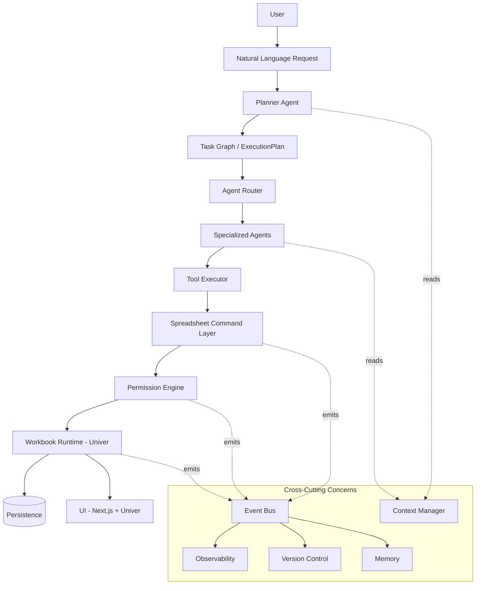
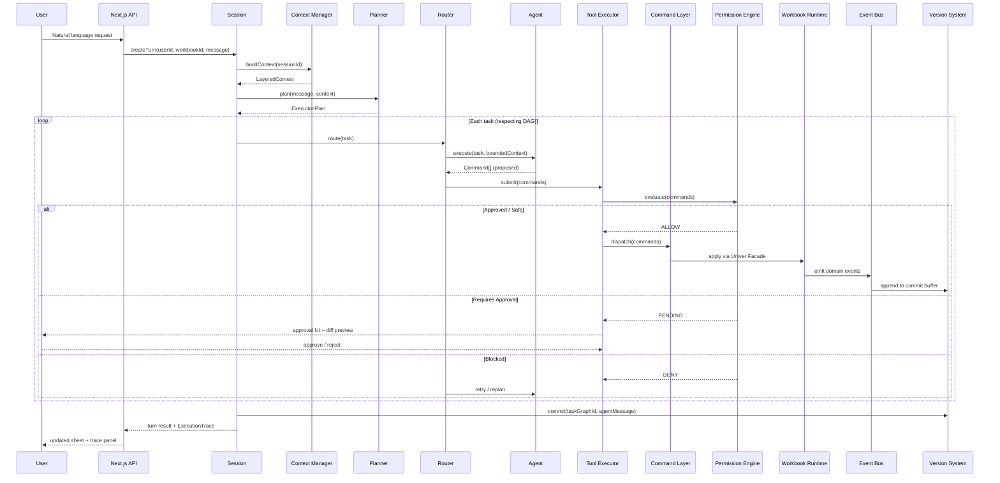
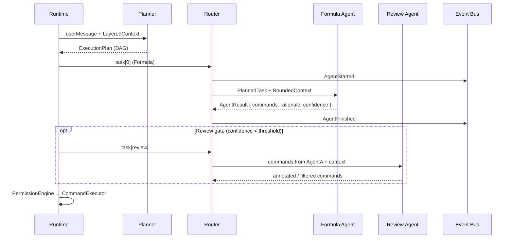
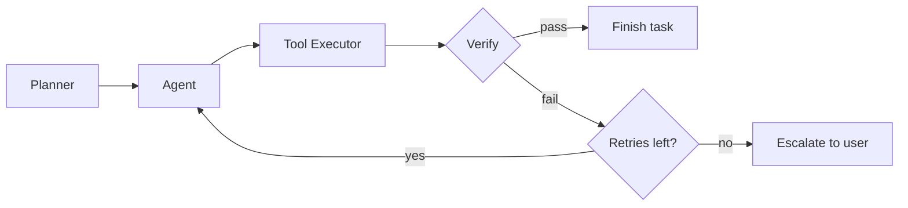
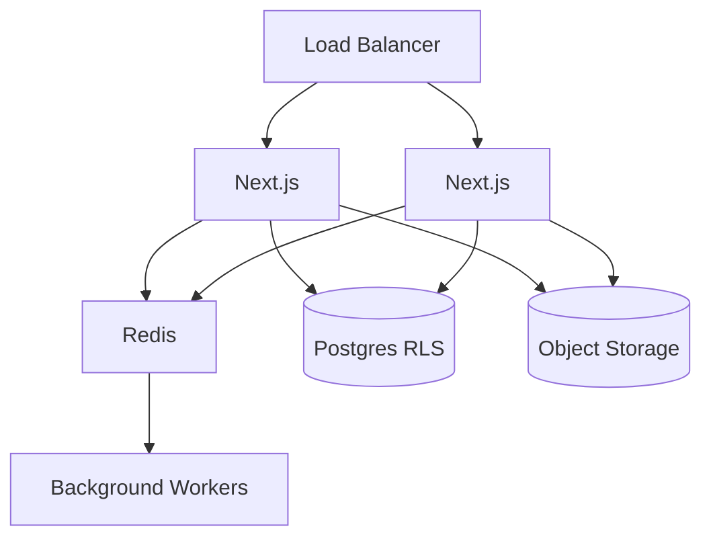
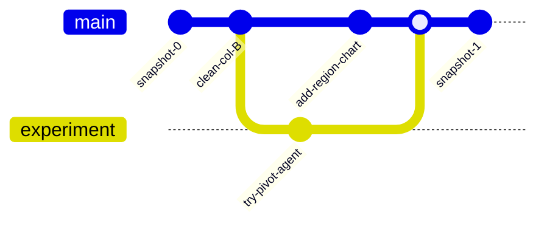

# Mona — Agentic Spreadsheet Runtime Architecture

**Stack:** Turborepo · Next.js · TypeScript · Univer Sheet · Node.js · Postgres · Redis  
**Philosophy:** ~2% intelligence, ~98% infrastructure. The LLM decides *what*; the runtime decides *how*, safely, deterministically, and reproducibly.

---

## 0. Design Principles

| Principle | Implication |
|---|---|
| LLM never touches state | Agents emit `Command` objects only |
| Everything is an event | Append-only log; workbook is a materialized view |
| Deny-first permissions | No command executes without `PermissionEngine` |
| Deterministic core | Command layer, permissions, versioning are pure and testable |
| Replayable by construction | `snapshot(t0) + commands[t0..tn]` reconstructs any state |
| Swappable agents | All agents implement the same `Agent` interface |

---

## 1. High-Level Architecture



### Layer Determinism Matrix

| Layer | Deterministic? | LLM? | Mutates Workbook? |
|---|---|---|---|
| Planner Agent | No | Yes | No |
| Agent Router | Yes | No | No |
| Specialized Agents | No | Yes | No — Commands only |
| Tool Executor | Yes | No | No |
| Command Layer | Yes | No | No — intent only |
| Permission Engine | Yes | No | No — gate only |
| Workbook Runtime | Yes | No | **Yes — sole mutator** |

---

## 2. Class Diagram (Core Domain)

```mermaid
classDiagram
    class MonaRuntime {
        +executeTurn(input: TurnInput): Promise~TurnResult~
        +resume(sessionId: string): Promise~TurnResult~
        +cancel(turnId: string): void
    }

    class PlannerAgent {
        +plan(message: string, ctx: LayeredContext): Promise~ExecutionPlan~
    }

    class AgentRouter {
        +execute(task: PlannedTask, ctx: LayeredContext): Promise~Command[]~
        +executePlan(plan: ExecutionPlan, ctx: LayeredContext): Promise~Command[]~
    }

    class Agent {
        <<interface>>
        +id: AgentId
        +capabilities: Capability[]
        +run(task: PlannedTask, ctx: LayeredContext): Promise~AgentResult~
    }

    class CommandExecutor {
        +dispatch(cmd: BaseCommand): Promise~CommandResult~
        +dispatchBatch(cmds: BaseCommand[]): Promise~CommandResult[]~
    }

    class PermissionEngine {
        +evaluate(cmd: BaseCommand): PermissionDecision
        +evaluateBatch(cmds: BaseCommand[]): PermissionDecision[]
    }

    class ContextManager {
        +build(sessionId: string, request: string, budget: number): Promise~LayeredContext~
        +invalidate(layer: ContextLayer): void
    }

    class EventBus {
        +emit(event: MonaEvent): void
        +subscribe(type: string, handler: EventHandler): Unsubscribe
    }

    class VersionStore {
        +commit(commands: BaseCommand[], message: string): Promise~Commit~
        +restore(commitId: string): Promise~WorkbookSnapshot~
        +diff(from: string, to: string): Promise~CellDiff[]~
    }

    class MemoryStore {
        +get(scope: MemoryScope, key: string): Promise~unknown~
        +set(scope: MemoryScope, key: string, value: unknown): Promise~void~
        +semanticSearch(scope: MemoryScope, query: string, k: number): Promise~MemoryHit[]~
    }

    MonaRuntime --> PlannerAgent
    MonaRuntime --> AgentRouter
    MonaRuntime --> CommandExecutor
    MonaRuntime --> ContextManager
    MonaRuntime --> EventBus
    AgentRouter --> Agent
    CommandExecutor --> PermissionEngine
    CommandExecutor --> EventBus
    VersionStore --> EventBus
    MemoryStore --> EventBus
```



---

## 3. Monorepo Structure

```
mona/
├── apps/
│   └── web/                    # Next.js — chat UI, sheet UI, diff viewer
├── packages/
│   ├── shared/                 # Core types, schemas, utilities
│   ├── commands/               # Command definitions + CommandExecutor
│   ├── events/                 # Event bus + event schema
│   ├── permissions/            # PermissionEngine + policies
│   ├── memory/                 # Long-term / session / workspace / workbook memory
│   ├── context/                # Layered context assembly
│   ├── tools/                  # Tool schemas for LLM tool-use
│   ├── spreadsheet/            # Univer adapter (sole Univer import)
│   ├── versioning/             # Git-like commit/branch/diff/restore
│   ├── observability/        # Tracing, metrics, execution traces
│   ├── planner/                # Planner Agent + ExecutionPlan builder
│   ├── agents/                 # Specialized agent implementations
│   ├── router/                 # Agent Router
│   ├── runtime/                # Orchestration loop
│   └── sdk/                    # Public Agent SDK / Plugin API
├── docs/architecture/
└── turbo.json
```

---

## 4. Runtime Lifecycle



---

## 5. Agent Communication Protocol

Agents never communicate directly. All coordination flows through the runtime.



**Protocol rules:**

1. **Input:** `PlannedTask` + `LayeredContext` bounded to `inputRanges`
2. **Output:** `AgentResult` with `commands[]`, `rationale`, `confidence`
3. **No side effects:** agents cannot emit events, mutate state, or call other agents
4. **Correlation:** every message carries `correlationId` = turn/plan/task id
5. **Cancellation:** `AbortSignal` propagated from Runtime → Router → Agent LLM call

---

## 6. Context Pipeline

```mermaid
flowchart LR
    subgraph Sources
      S1[Session Store]
      S2[Workbook Metadata]
      S3[Univer Selection]
      S4[Dependency Graph Cache]
      S5[Version Store]
      S6[Semantic Summary Cache]
    end

    subgraph Layers[L1-L10 Layers]
      L1[Conversation]
      L2[Workbook Meta]
      L3[Active Sheet]
      L4[Selection]
      L5[Referenced Ranges]
      L6[Dependency Slice]
      L7[Named Ranges]
      L8[Version Summary]
      L9[Recent Edits]
      L10[Semantic Summary]
    end

    subgraph Pipeline
      R[Relevance Ranker]
      C[Compressor]
      B[Token Budgeter]
    end

    Sources --> Layers
    Layers --> R --> C --> B
    B --> LayeredContext
```



**Priority order (never drop under pressure):** L4 Selection → L5 Referenced Ranges → L3 Active Sheet → L1 Conversation (last 5 turns) → L6 Dependency slice → L2 Meta → L7 Named ranges → L9 Recent edits → L8 Version summary → L10 Semantic summary.

**Incremental invalidation:**

| Event | Invalidated Layers |
|---|---|
| `SelectionChanged` | L4, L5 |
| `CellEdited` | L3, L6, L9, L10 (patch) |
| `SheetCreated` | L2, L3, L10 (full regen) |
| `VersionCreated` | L8 |

---

## 7. Planner Algorithm

```
PLAN(userMessage, context):
  1. INTENT_DECOMPOSE — LLM structured output → PlannedTask[]
  2. DEPENDENCY_DETECT — for each pair (A, B):
       if B.readRanges ∩ A.writeRanges ≠ ∅ → edge A→B
  3. AGENT_SELECT — map intent keywords → capability tags → AgentId
       fallback: ai-assistant-agent
  4. COST_ESTIMATE — Σ(tokenEstimate(task) + commandEstimate(task))
  5. EXECUTION_MODE —
       if DAG has parallel branches AND totalCommands < batchThreshold:
         mode = parallel (with range-conflict serialization)
       else:
         mode = sequential / hybrid with approval checkpoints
  6. RETURN ExecutionPlan { tasks, edges, estimatedCost, executionMode }
```

The Planner **never emits Commands**.

---

## 8. Router Algorithm

```
ROUTE(task, context):
  1. agent ← registry[task.agent] ?? registry['ai-assistant-agent']
  2. boundedCtx ← intersect(context, task.inputRanges)
  3. emit AgentStarted
  4. WITH retry (maxRetries), timeout (agent.timeoutMs), cancelToken:
       result ← agent.run(task, boundedCtx)
  5. emit AgentFinished
  6. RETURN result.commands

EXECUTE_PLAN(plan, context):
  1. topoSort ← topologicalSort(plan.tasks, plan.edges)
  2. IF plan.executionMode == 'parallel':
       schedule independent waves; serialize overlapping write ranges
  3. ELSE:
       execute sequentially
  4. MERGE outputs; dedupe conflicting commands → Review Agent
  5. RETURN all commands
```

---

## 9. Command Pattern

Commands are immutable, serializable, replayable, undoable, versionable data structures.

See `packages/commands/src/types.ts` and `packages/commands/src/executor.ts`.

**Properties:**

- **Immutable** — readonly fields; supersede, never mutate
- **Serializable** — plain JSON payloads
- **Replayable** — pure reducer at adapter boundary
- **Undoable** — handlers compute inverse commands
- **Versionable** — atomic unit grouped into Commits

---

## 10. Event System

Event sourcing backbone. Transport: in-process EventEmitter + Redis Streams for durability.

See `packages/events/src/schema.ts` and `packages/events/src/bus.ts`.

Every event carries `correlationId` for trace reconstruction.

---

## 11. Permission System

Deny-first. Default = BLOCKED unless a policy explicitly allows.

See `packages/permissions/src/engine.ts` and `packages/permissions/src/policies/core.ts`.

**Defense in depth:** agent write scope bounded at tool-schema level AND re-validated by PermissionEngine.

---

## 12. Memory Architecture

| Scope | Lifetime | Store | Contents |
|---|---|---|---|
| Session | Single chat | Redis | turns, in-flight plan |
| Workbook | Life of file | Postgres + pgvector | schema, formulas, semantic summary |
| Workspace | Life of org | Postgres | terminology, templates |
| Long-term (user) | Cross-workbook | Postgres + pgvector | preferences, workflows |

See `packages/memory/src/store.ts`.

---

## 13. Version Control

Git-like: snapshots, commits, branches, restore, compare, visual diff.

- Commits bundle command sets per completed turn
- Snapshots every N commits for fast restore
- Formula diffs primary; computed values on hover
- Agent-generated commit messages from `AgentResult.rationale`

See `packages/versioning/src/`.

---

## 14. Recovery Architecture

| Failure | Recovery |
|---|---|
| Browser crash | Replay local buffer against last server commit |
| Server crash mid-plan | Resume from last completed task (Postgres state) |
| Partial execution (3/5 cmds) | Applied cmds stay; failed cmd gets inverse + retry |
| Semantically wrong output | Undo chain or `restore(commitId)` |
| Corrupted snapshot | Fall back to older snapshot + longer replay |

---

## 15. Observability

`ExecutionTrace` per turn: latency, tokens, agent timeline, commands, permission decisions, errors, retries.

Tracer is a pure EventBus subscriber — zero coupling to producers.

See `packages/observability/src/tracer.ts`.

---

## 16. Plugin Architecture

```typescript
interface MonaPlugin {
  id: string;
  registerAgents?(): Agent[];
  registerCommands?(): CommandHandler[];
  registerPolicies?(): PermissionPolicy[];
  registerTools?(): ToolDefinition[];
  onEvent?(event: MonaEvent): void;
}
```

MCP servers wrapped by `mcp-agent` — same PermissionEngine, no bypass.

See `packages/sdk/src/index.ts`.

---

## 17. Agent Loop



Verification (deterministic, Univer-native): formula correctness, broken refs, circular deps, chart validity, range existence, permission compliance.

---

## 18. DDD Bounded Contexts

| Context | Package | Responsibility |
|---|---|---|
| Planning | `@repo/planner` | Intent → ExecutionPlan |
| Execution | `@repo/commands`, `@repo/runtime` | Command dispatch |
| Permissions | `@repo/permissions` | Authorization |
| Spreadsheet | `@repo/spreadsheet` | Univer adapter |
| Versioning | `@repo/versioning` | History, diff, restore |
| Memory | `@repo/memory` | Persistent context |
| Observability | `@repo/observability` | Traces, metrics |

Cross-context communication: Events or explicit interfaces only. No shared mutable state.

---

## 19. CQRS

- **Write path:** Planner → Agent → Command → Permission → Executor
- **Read path:** Direct against materialized projections (Univer state, cached dependency graph, semantic summary)
- Reads never block on write pipeline

---

## 20. Event Sourcing

Workbook state = projection of command/event log. Snapshots are performance optimization, not source of truth.

```
WorkbookState(t) = fold(initialState, commands[0..t])
Commit = { commandIds[], parentId, message, contentHash }
```

---

## 21. SOLID Application

| Principle | Application |
|---|---|
| SRP | Planner plans, Router routes, Executor applies |
| OCP | New agents/commands/policies via registry, not switch edits |
| LSP | All Agent/CommandHandler/Policy implementations substitutable |
| ISP | Minimal `Agent` interface (`run()` + metadata) |
| DIP | Runtime depends on interfaces, not concrete agents |

---

## 22. Security Model

- Univer isolation: only `@repo/spreadsheet` imports Univer SDK
- Command-level authz via `issuedBy` + role-scoped policies
- Python/SQL in ephemeral network-restricted containers
- Postgres RLS by `tenantId`; Redis/object storage namespaced
- LLM keys server-side only
- Hash-chained commits for tamper-evident audit trail

---

## 23. Multi-Tenant SaaS



Stateless web tier; durable state in Postgres/Redis/Object Storage. Heavy agents offloaded to workers via Redis queues.

---

## 24. Performance & Scaling

- Context token budgeting (primary LLM cost lever)
- Incremental dependency graph (Redis cache per workbook)
- Parallel DAG execution with range-conflict serialization
- Periodic snapshots amortize replay
- CQRS read/write split
- Horizontal worker scaling for Python/SQL/import agents

---

## 25. Testing Strategy

| Layer | Approach |
|---|---|
| Command handlers | Pure unit tests, no LLM |
| Permission Engine | Table-driven policy matrix |
| Verification | Golden-file broken formula tests |
| Router/Loop | Mock agents for retry/timeout/parallel |
| Context Manager | Snapshot tests on compression |
| Version system | Property: restore == replay |
| Planner/Agents | Eval harness + scheduled live regression |
| E2E | Playwright: NL → diff + commit message |

---

## 26. Implementation Roadmap

| Phase | Deliverables |
|---|---|
| **0 — Foundations** | Univer adapter, Command types + Executor, Formula Agent, minimal PermissionEngine |
| **1 — Core loop** | Event Bus, Observability trace, Verification, Undo/Redo |
| **2 — Planning** | Planner + Router, Data Cleaning/Chart/Formatting agents |
| **3 — Version control** | Commits, snapshots, diff viewer |
| **4 — Memory & context** | Layered Context Manager, semantic summary, memory stores |
| **5 — Scale** | Multi-tenant RLS, sandboxed Python/SQL, background workers, branches |
| **6 — Extensibility** | Agent SDK, MCP wrapper, plugin hooks, community registry |

---

## 27. TypeScript Interface Index

All interfaces live in their respective packages:

| Interface | Package |
|---|---|
| `BaseCommand`, `CommandResult` | `@repo/commands` |
| `MonaEvent`, `EventBus` | `@repo/events` |
| `PermissionPolicy`, `PermissionEngine` | `@repo/permissions` |
| `LayeredContext`, `ContextManager` | `@repo/context` |
| `ExecutionPlan`, `PlannedTask` | `@repo/planner` |
| `Agent`, `AgentResult` | `@repo/agents` |
| `Commit`, `CellDiff` | `@repo/versioning` |
| `ExecutionTrace` | `@repo/observability` |
| `MonaPlugin` | `@repo/sdk` |
| `A1Range`, `AgentId`, `RiskLevel` | `@repo/shared` |

---

## 28. Production Code Skeleton Index

| Component | Package | Entry Point |
|---|---|---|
| `MonaRuntime` orchestrator | `@repo/runtime` | `packages/runtime/src/runtime.ts` |
| `AgentLoop` (verify/retry) | `@repo/runtime` | `packages/runtime/src/agent-loop.ts` |
| `SessionStore` / `RecoveryManager` | `@repo/runtime` | `packages/runtime/src/session.ts` |
| `PlannerAgent` | `@repo/planner` | `packages/planner/src/planner.ts` |
| `AgentRouter` | `@repo/router` | `packages/router/src/router.ts` |
| `AgentRegistry` (17 agents) | `@repo/agents` | `packages/agents/src/registry.ts` |
| `CommandExecutor` + handlers | `@repo/commands` | `packages/commands/src/executor.ts` |
| `EventBus` / `DurableEventBus` | `@repo/events` | `packages/events/src/bus.ts` |
| `PermissionEngine` + policies | `@repo/permissions` | `packages/permissions/src/engine.ts` |
| `ContextManager` (L1–L10) | `@repo/context` | `packages/context/src/context-manager.ts` |
| `InMemoryStore` / `SemanticSummarizer` | `@repo/memory` | `packages/memory/src/store.ts` |
| `UniverAdapter` + `DependencyGraph` | `@repo/spreadsheet` | `packages/spreadsheet/src/univer-adapter.ts` |
| `CommitStore` / `VersionRestorer` / diff | `@repo/versioning` | `packages/versioning/src/` |
| `ExecutionTracer` | `@repo/observability` | `packages/observability/src/tracer.ts` |
| `ToolRegistry` | `@repo/tools` | `packages/tools/src/tool-registry.ts` |
| `MonaPlugin` / `PluginRegistry` | `@repo/sdk` | `packages/sdk/src/index.ts` |
| API entry point | `apps/web` | `apps/web/app/api/ai/chat/route.ts` |

---

## 29. Version Branch Graph



---

## 30. Architectural Invariants (never violate)

1. **LLM → Commands only.** No agent imports `@repo/spreadsheet`.
2. **Univer → adapter only.** Only `@repo/spreadsheet` imports Univer SDK.
3. **Deny by default.** Unrecognized commands are blocked.
4. **Bounded write scope.** Enforced at tool schema AND PermissionEngine.
5. **Event correlation.** Every turn traceable via `correlationId`.
6. **Replay = truth.** State is `snapshot + commands`, not mutable snapshots alone.
